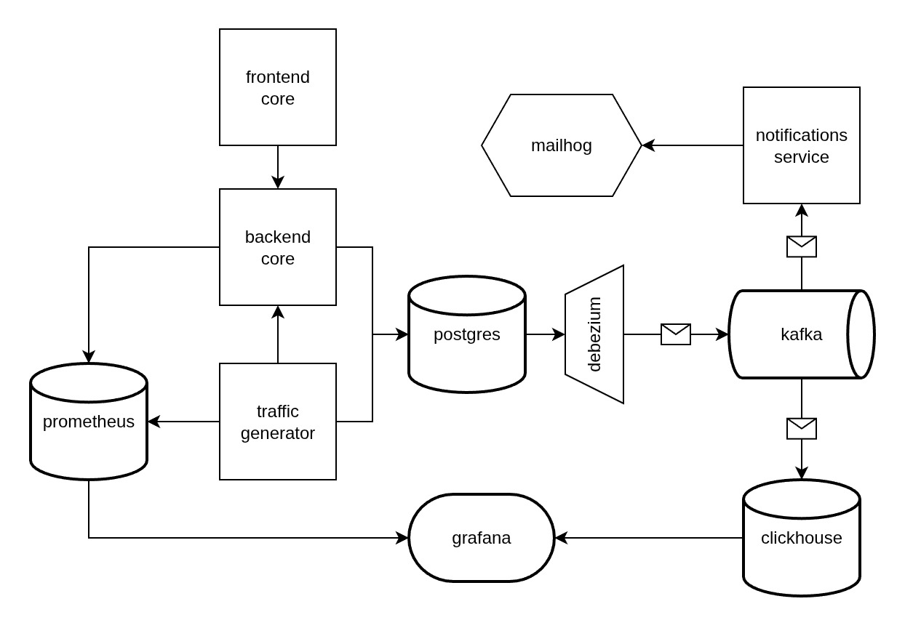

# Polybank

Банковский сервис, состоящий из нескольких взаимодействующих компонентов: REST API на Spring Boot, событийная интеграция через outbox-паттерн и Kafka, отдельный сервис уведомлений, потоковая аналитика на ClickHouse с визуализацией в Grafana, фронтенд на React/TypeScript и CI/CD-пайплайн с деплоем в Kubernetes-кластер на RKE2.

Проект охватывает: доменную модель банка (пользователи, счета, транзакции), ролевую модель доступа, транзакционную публикацию доменных событий, миграции схемы БД, потоковую обработку событий и деплой в Kubernetes через Helm.

## Архитектура

Пользователь работает через `webapp`, который обращается к `app` по HTTP с JWT-аутентификацией. Каждая доменная операция в `app` в той же транзакции пишет событие в outbox-таблицу, чтобы событие не потерялось и не появилось без соответствующей бизнес-операции. Debezium читает outbox через CDC и публикует события в Kafka, откуда их независимо разбирают `notification` (email через MailHog) и ClickHouse с дашбордом в Grafana. `traffic-generator` работает отдельно, генерируя нагрузку на `app`. Весь стек разворачивается в Kubernetes (RKE2) через Helm-чарт.

## Модули

| Модуль | Стек                                                           | Назначение |
|---|----------------------------------------------------------------|---|
| `app` | Java 25, Spring Boot 3, jOOQ, Liquibase, Spring Security, JJWT | Ядро банка: пользователи, счета, транзакции, доменная логика, публикация событий |
| `notification` | Java, Spring Boot                                              | Consumer доменных событий из Kafka, формирование и отправка email-уведомлений о транзакциях, регистрации и создании счетов |
| `webapp` | React 18, TypeScript, Vite, Ant Design, Axios                  | SPA-интерфейс: регистрация/вход, управление счетами, переводы, история операций, отдельные экраны и Grafana-дашборд для ролей MANAGER/SENIOR_MANAGER |
| `analytics` | ClickHouse, Grafana, Kafka                                     | Потоковая аналитика банковских событий в реальном времени поверх Kafka engine и materialized view |
| `debezium` | Debezium 3.4 / Kafka Connect                                   | CDC-коннектор поверх outbox-таблицы Postgres, гарантирует доставку доменных событий без двойной записи |
| `traffic-generator` | Kotlin, Ktor                                                   | Генератор синтетической нагрузки на API для нагрузочного тестирования и наполнения аналитического контура |
| `helm/polybank` | Helm chart                                                     | Полный набор манифестов для деплоя всех сервисов в Kubernetes: Deployment/Service/ConfigMap/Secret для backend, frontend, notification, generator, отдельно — кластер Postgres |
| `.teamcity` | Kotlin DSL                                                     | Описание CI/CD-пайплайна: сборка, тестирование, сборка образов, деплой в тестовый и продовый контуры |

## Доменная модель

Ядро `app` построено вокруг трёх агрегатов:

- **User** — учётная запись пользователя с логином, email, набором ролей (`RoleEntity`) и статусом блокировки. Аутентификация построена на JWT (`JwtHelper`, `JwtFilter`, `JwtAuthenticationEntryPoint`), кастомном `UserDetailsService` (`AuthUserDetailsService`) поверх Spring Security.
- **Account** — банковский счёт (`AccountEntity`, `AccountNumber`, `AccountInfo`) с жизненным циклом: активен → заморожен/разморожен → закрыт/заблокирован. Заморозка/разморозка доступна владельцу и авторизованным пользователям, блокировка/разблокировка — только ролям `MANAGER`/`SENIOR_MANAGER`.
- **Transaction** — операция по счёту (`TransactionEntity`, `TransactionWithAccountNumbersView`): пополнение, снятие, перевод между счетами. Отмена транзакции — привилегия `MANAGER`/`SENIOR_MANAGER`.

Доступ к данным реализован через jOOQ с кодогенерацией по актуальной схеме (`jooq-codegen-maven`), версии схемы БД контролируются Liquibase-миграциями (`db/changelog`).

## Событийная модель и гарантии доставки

Каждая значимая доменная операция (регистрация пользователя, создание счёта, создание транзакции) порождает событие (`UserRegisteredEvent`, `AccountCreatedEvent`, `TransactionCreatedEvent`), которое пишется в outbox-таблицу через `OutboxWriter`/`JooqOutboxRepository` **в той же транзакции**, что и сама бизнес-операция. Это устраняет классическую проблему dual write: событие не может "потеряться", если бизнес-операция прошла, и не может быть отправлено, если она откатилась.

Debezium читает outbox-таблицу через логическую репликацию Postgres и публикует события в Kafka. Дальше события разбираются двумя независимыми потребителями:

- **notification** — конвертирует событие в DTO (`NotificationEventDto`), проводит через `DeliveryPlanningService` и `DeliveryDispatchService`, отправляет email через `EmailNotificationSender` (в деве — через MailHog).
- **ClickHouse** — события из топика `bank.events` попадают в очередь-таблицу `bank_events_queue`, откуда materialized view `bank_events_queue_to_raw` кладёт их в `bank_events_raw` для аналитических запросов, поверх которых построен дашборд в Grafana.

## Инфраструктура и деплой

- **Kubernetes / RKE2.** Все сервисы описаны Helm-чартом `helm/polybank`: отдельные Deployment/Service для backend, frontend, notification, generator, ConfigMap/Secret для конфигурации и секретов, отдельный манифест для кластера Postgres (`postgres-cluster.yaml`) и `ResourceQuota` на неймспейс. Конфигурации тестового и продового окружений разведены через `values.yaml` / `values-test.yaml`.
- **CI/CD.** Пайплайн описан в TeamCity Kotlin DSL (`.teamcity`): `BuildBuild` — сборка и прогон тестов, `MrBuild` — проверка merge request, сборка Docker-образов и публикация в приватный registry, `DeployBuild` — раскатка в тестовый контур, `ProdBuild`/`ProdDeployBuild` — сборка и деплой в продовый контур. Шаги для Helm и работы с БД вынесены в переиспользуемые хелперы (`HelmSteps.kt`, `DBSteps.kt`).
- **Брокер и CDC.** Kafka 4.3 как единая шина событий, Debezium/Kafka Connect 3.4 — CDC-коннектор поверх outbox-таблицы с отдельной репликационной слот-логикой в Postgres.
- **Наблюдаемость.** Spring Boot Actuator + Micrometer с экспортом метрик в формате Prometheus на стороне `app`; на стороне аналитики — Grafana-дашборды поверх ClickHouse с провижининговыми файлами datasource/dashboards.
